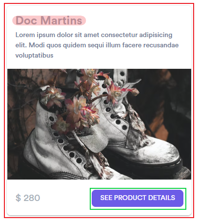

# Locators
## getByText(), getByTestId(), ... 👩‍💻

With these new APIs writing locators is a joy:
- `Page.getByText` to locate by text content.
- `Page.getByRole` to locate by [ARIA role](https://www.w3.org/TR/wai-aria-1.2/#roles), [ARIA attributes](https://www.w3.org/TR/wai-aria-1.2/#aria-attributes) and [accessible name](https://w3c.github.io/accname/#dfn-accessible-name).
- `Page.getByLabel` to locate a form control by associated label's text.
- `Page.getByPlaceholder` to locate an input by placeholder.
- `Page.getByAltText` to locate an element, usually image, by its text alternative.
- `Page.getByTitle` to locate an element by its title.

```js
await page.getByLabel('User Name').fill('John');

await page.getByLabel('Password').fill('secret-password');

await page.getByRole('button', { name: 'Sign in' }).click();

await expect(page.getByText('Welcome, John!')).toBeVisible();
```

### click
### fill
### Locators are strict
## Selectors
### Wow so many types
```js
// Texte
await page.locator('text=Log in').click();

// CSS
await page.locator('#nav-bar .contact-us-item').click();

// Attribut
await page.locator('[aria-label="Sign in"]').click();

// Sélecteur positionnel
await page.locator('input:right-of(:text("Username"))').click();

// Combiner les sélecteurs
await page.locator('header >> text=Contact Us').click();

// Et la possibilité de créer des sélecteurs

```

### Best practices
Prioritize user-facing attributes
Define explicit contract
Avoid selectors tied to implementation
https://playwright.dev/docs/selectors#best-practices

## Advanced locators 👩‍💻
https://playwright.dev/docs/selectors#selecting-elements-that-contain-other-elements



```js
await page
  .locator('.shoes-card_card', {
    hasText: 'Doc Martins'
  })
  .locator('text=see product details')
  .click();
```

### has
### Filters
### Chaining

References  
https://playwright.dev/docs/selectors  
https://playwright.dev/docs/locators  
